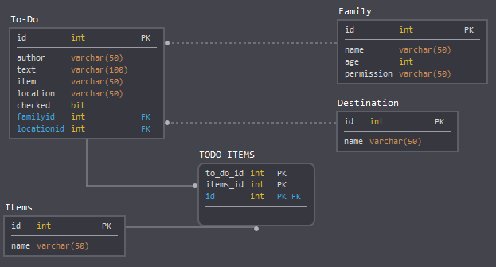
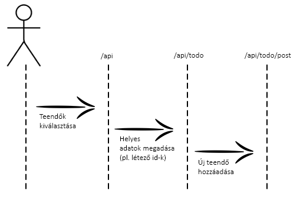
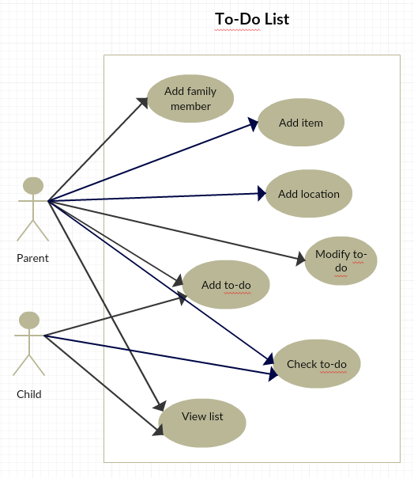
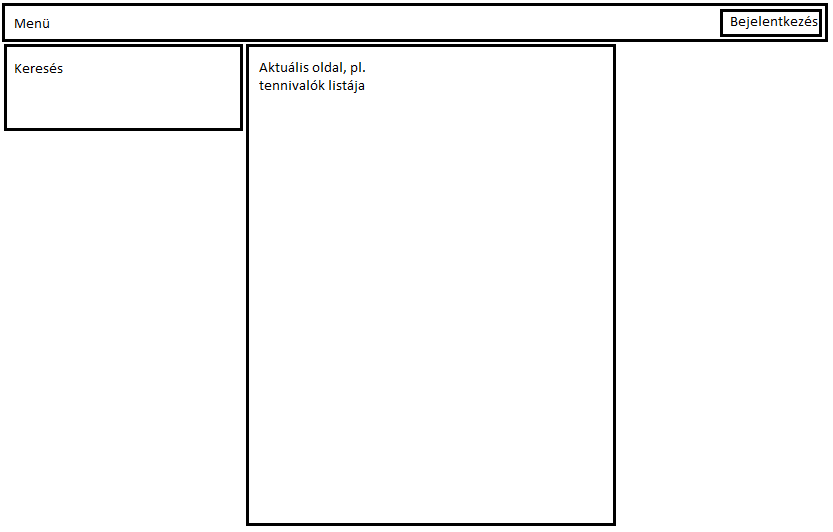

# Alkalmazások fejlesztése: TO-DO lista #

## Projektötlet ##

#### Funkcionális követelmények: ####

A funkciók elérése autentikációhoz kötött. A családtagoknak van egy felhasználó neve és egy jelszava,
amivel a teendőiket tudják kezelni, megnézni. Bejelentkezés után lesznek elérhetőek a funkciók.
Sikeres bejelentkezés után a felhasználó a kezdőoldalra kerül, innen tud tovább navigálni.
Ha a bejelentkezés sikertelen volt, a felhasználót értesíteni kell erről.
Lehetőség van feladatok és eszközök hozzáadására, törlésére, módosítására, szűrésére, listázására, feladatok állapotának változtatására.

#### Nem funkcionális követelmények: ####

Könnyen kezelhető, áttekinthető felhasználói felület.
Reszponzív megjelenés biztosítása különböző platformokon.

#### Szakterületi fogalomjegyzék: ####

* Teendő - a feladat, amit a személynek meg kell csinálnia
* Teendő hozzáadása - a családtagnak lehetősége van feladatokat felvenni
* Teendő kipipálása - a családtag ezzel jelezheti, hogy a teendőt elvégezte
* Eszköz - adott teendőhöz szükséges használati tárgy
* Helyszín - adott teendő elvégzési helye

#### Szerepkörök: ####
* Gyerek - olyan családtag, aki listázhat, adhat hozzá teendőt,kipipálhat teendőt
* Szülő - olyan családtag, aki listázhat, adhat hozzá teendőt, eszközt, helyszínt, kipipálhat teendőt, módosíthat meglévő teendőt és törölhet

## Backend megvalósítása ##

#### Fejlesztői környezet ####

* Git verziókezeló, Github
* TypeScript
* Java, Spring Boot
* Visual Studio Code lokális IDE
* Insomnia kliens
* Indítás: cmd, projektkönyvtárban mvnw.cmd spring-boot:run

#### Adatbázis-terv ####

Négy táblát és egy összekötő táblát használunk. 

* Family: a családtagok listája – név, életkor, jogkör (szülő, vagy gyerek)
* Destination: a teendő elvégzési helyszíne (pl. kutyasétáltatás - park)
* Items: a teendő elvégzéséhez lehetségesen szükséges eszközök (pl. vásárlás – szatyor, autó)
* To-Do: a teendők listája – szerző, teendő, eszközök, helyszín, elvégzett-e

#### Könyvtárstruktúra ####

* FamilyToDoApplication
* annotation
	* Rolse
* controller
	* AuthController
	* DestinationController
	* FamilyController
	* ItemsController
	* ToDoController
* interceptor
	* AuthInterceptor
* model
	* Destination
	* Family
	* Items
	* ToDo
	* User
* repository
	* DestinationRepository
	* FamilyRepository
	* ItemsRepository
	* ToDoRepository
	* UserRepository
* service
	* DestinationService
	* FamilyService
	* ItemsService
	* SessionService
	* ToDoService
	
#### Végponttervek ####

* GET / - Főoldal
* POST /api/auth/login – Bejelentkezés elküldése
* POST /api/auth/logout – Kijelentkezés
* GET /api/auth/user - Aktuális felhasználó lekérdezése
* GET /api/destination/all - Helyszínek listázása
* POST /api/destination/post - Helyszín hozzáadása
* DELETE /api/destination/:id - Helyszín törlése
* GET /api/family/all - Családtagok listázása
* POST /api/family/post - Családtag hozzáadása
* DELETE /api/family/:id - Családtag törlése
* GET /api/items/all - Eszközök listázása
* POST /api/items/post - Eszköz hozzáadása
* DELETE /api/items/:id - Eszköz törlése
* GET /api/todo/all - Teendők listázása
* DELETE /api/todo/:id - Teendő törlése
* POST /api/todo/post - Teendő hozzáadása:

## Működő prototípus ##

#### Használati eset diagram ####

#### Fejlesztői környezet ####

* Git verziókezeló, Github
* Angular
* Bootstrap
* Visual Studio Code lokális IDE
* Indítás: cmd, projektkönyvtárban függőségek telepítése: npm install, majd ng serve, böngészőben localhost:4200

#### Könyvtárstruktúra ####

* app
	* about-page
	* destination-list
	* destination-page
	* family-list
	* family-page
	* header
	* item-list
	* item-page
	* listing-only-items
	* page-container
	* page-not-found
	* search
	* search-result-page
	* sidebar
	* sign-in-page
	* sign-up-page
	* todo-list
* services
	* destination
	* family
	* items
	* todo
	*user-service
* assets
	* images

#### Oldalvázlat ####

## Kész alkalmazás ##

#### Kliensoldali szolgáltatások ####

* A főoldalon megjelenik a tennivalók listája, ki adta hozzá, mi az adott feladat és milyen eszközöket igényel.
* Az eszközökre kattintva megjelenik az eszközök listája.
* A helyszínekre kattintva megjelenik a helyszínek listája.
* A családra kattintva megjelennek a családtagok adatai, név, életkor, jogkör.
* A bejelentkezésre/regisztrációra kattintva megjelenik egy kitöltendő űrlap, amelyet kitöltve lehet továbblépni a főoldalra, és elérhetővé válnak új funkciók.
* Lehetőség van szűrésre a teendők között.
* Lehetőség van szerkesztésre/törlésre/hozzáadásra bejelentkezés után. 

